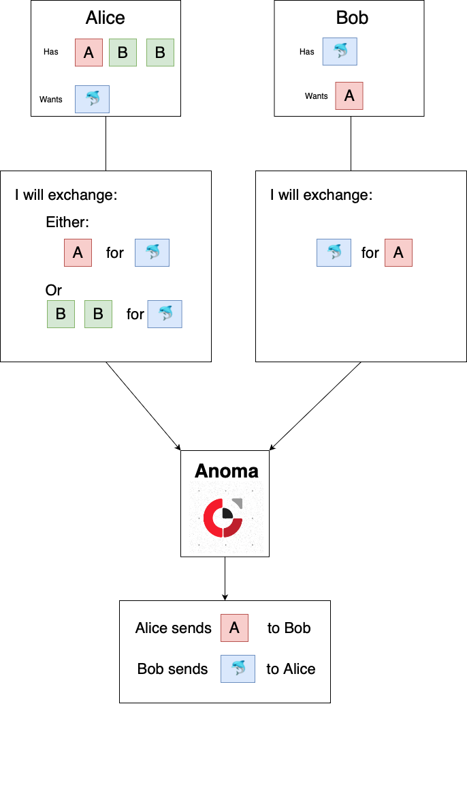

# Anoma Two-party exchange

There are two parties, Alice and Bob. Alice wants a dolphin and is willing to
trade either an A token or 2 B tokens for it. Bob has a blue dolphin and wants
an A token in exchange.

Both Alice and Bob create partial transactions which express their preferences
and submit them to Anoma.

Anoma creates a full transaction that satisfies the preferences of Alice and
Bob.

