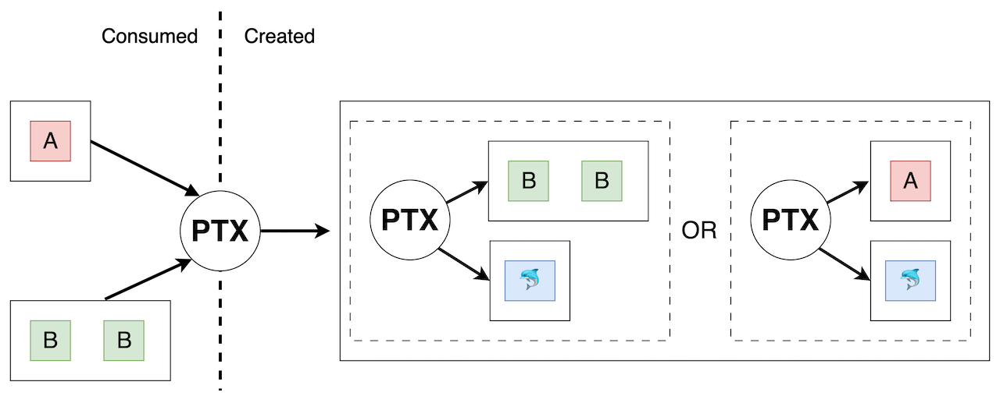
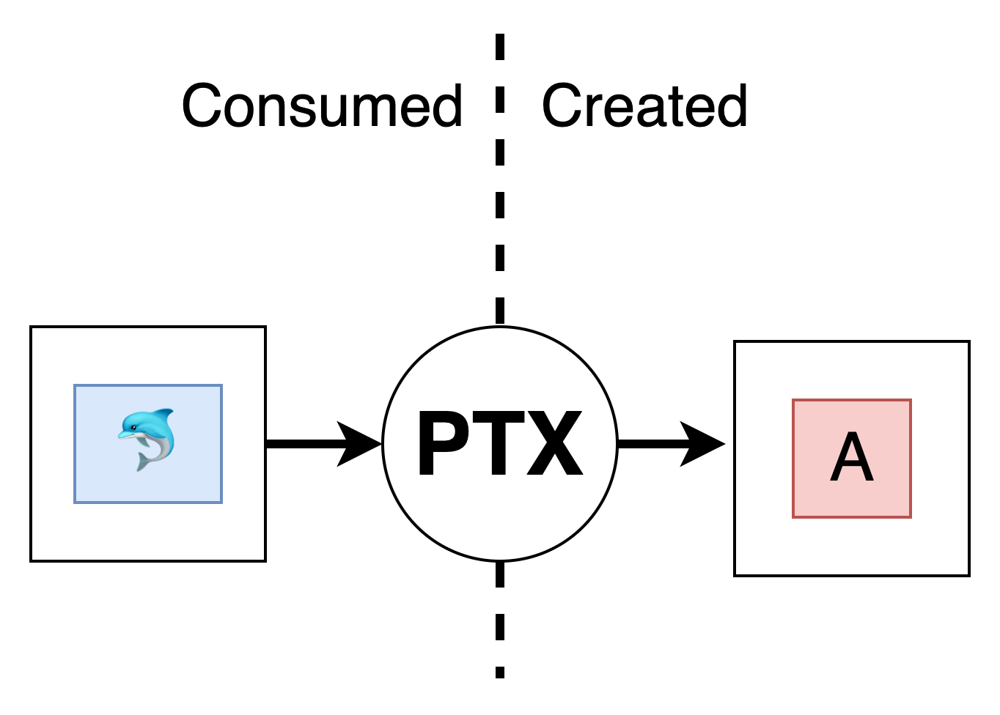
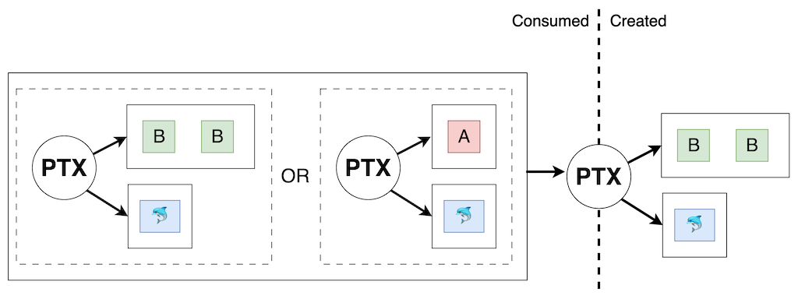
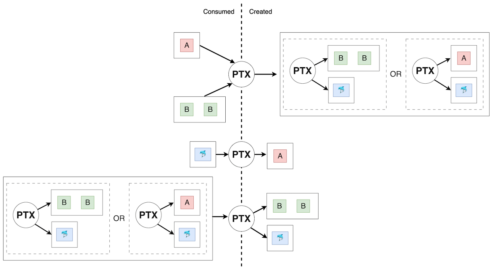

# Anoma / Taiga

[Taiga](https://github.com/anoma/taiga) is a component of Anoma that is used to
produce valid state transition proposals. Taiga defines what a valid transaction
is and provides the means to produce and verify transactions.

The parts of a transaction are are distributed and stored in an encrypted form.

Taiga is based on a [UTXO
model](https://en.wikipedia.org/wiki/Unspent_transaction_output) and was heavily
inspired by [Zcash
Orchard](https://github.com/zcash/zips/blob/main/protocol/protocol.pdf) and
[ZEXE](https://eprint.iacr.org/2018/962).

Let's introduce the concepts of Taiga using an example.

# Two-party exchange

An example of using Taiga to facilitate an exchange between two participants.

See the corresponding [Taiga simulator
code](https://github.com/anoma/taiga-simulator/blob/main/Apps/TwoPartyExchange.juvix).

## Overview

In this scenario there are _Resource_ types **Dolphin**, **A** and **B**. There
are three participants, **Alice**, **Bob** and a **Solver**.

Alice owns:

* 1 **A**
* 2 **B**

Bob owns:

* 1 **Dolphin**

Alice is willing to exchange either 2 **B** or 1 **A** for 1 **Dolphin**. Bob is
willing to exchange 1 **A** for 1 **Dolphin**.

## Alice's Partial Transaction

Alice publishes a _partial transaction_ to the network that consumes two resources that she owns:

* 1 **A** resource
* 2 **B** resources

and creates a new resource containing a logic function which encodes her intent, i.e she wants to participate in a transaction that contains a partial transaction in which she receives either 1 **Dolphin** and **2 B** (i.e her **A** resource was spent) or 1 **Dolphin** and 1 **A** (i.e her **1 B** was spent).

## Bob's Partial Transaction

Bob independently publishes a _partial transaction_ to the network that encodes his intent.

It comsumes:

* 1 **Dolphin** resource

and creates:

* 1 **A** resource

## Solver's Partial Transaction

The Solver finds both Alice's and Bob's partial transactions it aims to create a
partial transaction which satisfies the logic function and balances the partial
transactions. This means a transaction satisfying both Alice and Bob's wishes
can be published.

It consumes:

* Alice's logic resource

And creates:

* 1 **Dolphin** resource
* 2 **B** resources

This partial transaction consumes a logic function, which means that the partial
transaction must satisfy its logic to be valid.

We can see that the first clause in the logic function is satisfied by the
transaction so it is valid.

## Final Transaction

A transaction is formed from a collection of valid partial transaction that
balance. i.e the quantities of created and consumed resources, for each resource
type in the transaction must balance.

We can check that the quantities of all the resource types balance in this case.

In particular:

* Solver create 2 **B** balances with Alice consume 2 **B**
* Solver create 1 **Dolphin** balances with Bob consume 1 **Dolphin**
* Sovler consume **Alice's logic resource** balances with Alice create **Alice's logic resource** 
* Alice consume 1 **A** balances with Bob create 1 **A**

So we conclude that the three partial transaction above together form a transaction.

